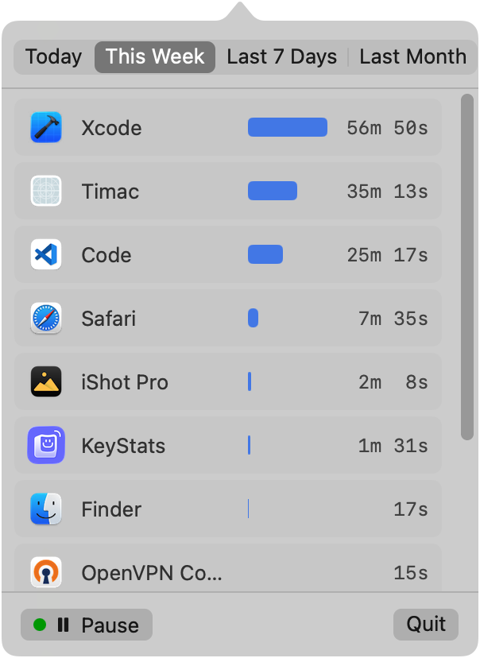

# Timac

A simple macOS menu bar app that tracks time spent on each application.



## Roadmap

- [ ] Save ADHD!

## Features

- **Menu Bar App**: Lives in the menu bar with an hourglass icon (⏳)
- **App Tracking**: Monitors the frontmost application and records usage time
- **Time Scale Selection**: View usage for Today, This Week, Last 7 Days, or Last Month
- **Start/Pause**: Control tracking with a single click
- **Clean UI**: Native macOS design with histogram bars

## Installation

### Option 1: Homebrew (Recommended)

```bash
brew tap ViGeng/tap
brew install --cask timac
```

### Option 2: Download from GitHub Releases

1. Go to the [Releases](https://github.com/ViGeng/Timac/releases) page
2. Download `Timac.dmg` or `Timac.zip`
3. Open the DMG and drag Timac to Applications, or unzip and move to Applications
4. **Important**: Since the app is not notarized, you need to remove the quarantine attribute:
   ```bash
   xattr -cr /Applications/Timac.app
   ```
   Or right-click the app → Open → Open (to bypass Gatekeeper once)

### Option 3: Build from source

```bash
git clone https://github.com/ViGeng/Timac.git
cd Timac
xcodebuild -project Timac.xcodeproj -scheme Timac -configuration Release
```

## Usage

1. Launch the app (appears as an hourglass icon in the menu bar)
2. Click the icon to open the popover
3. Tracking starts automatically on launch
4. Switch between apps normally - Timac tracks which app is in front
5. Use the segmented control to switch between time scales:
   - **Today**: Current day's usage
   - **This Week**: Usage since the start of the week
   - **Last 7 Days**: Rolling 7-day period
   - **Last Month**: Rolling 30-day period
6. Click "Pause" to stop tracking, "Start" to resume
7. Click "Quit" to exit the app

## Requirements

- macOS 15.6+

## Architecture

- **Core Data**: Stores `AppUsageRecord` entities with app name, bundle ID, and time ranges
- **AppTracker**: Singleton that monitors frontmost app changes via NSWorkspace notifications
- **AppUsageStats**: Aggregates records into usage summaries for different time scales
